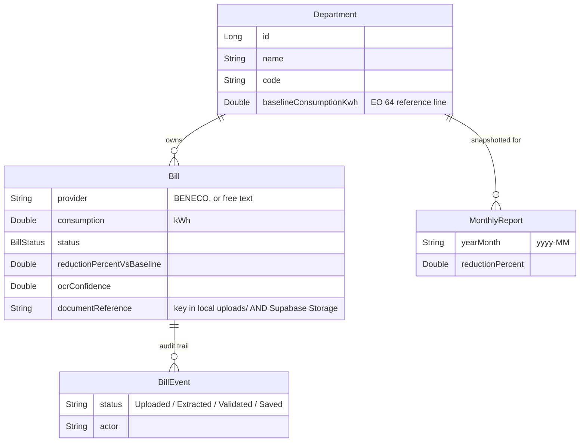

# Bill OCR Backend — Spec & Handoff

This is the backend for the OCR module of **TeamEnergy**: a Spring Boot service that takes a photo or PDF of a BENECO electricity bill, extracts the numbers, and turns them into the department leaderboard and 20%-reduction charts the capstone pitch promises (EO 64).

**Scope note:** the team agreed to focus on electricity (kWh) only for this phase — water/BWD is out, due to time constraints. The domain model below reflects that decision directly (no `UtilityType` branching anywhere); it's not water support that's temporarily disabled, it was designed out.

It's scaffolded and running — compiles clean, 5/5 tests pass, boots against both Supabase Postgres config and a local H2 fallback, and every endpoint below was hit manually and returned correct data. What's *not* done yet, or not yet verified against the real cloud services, is called out explicitly in [Known limitations](#8-known-limitations--next-steps) so nobody mistakes "scaffolded" for "finished."

---

## 1. Where it fits

```
team-energy/
├── src/                 (existing) React frontend — already expects everything below
└── backend/             (new) this Spring Boot service
```

The frontend's `BillLogging.jsx` already has a **mocked** two-step OCR flow (Upload → OCR extract → human Validate → Save) with a specific field contract. This backend was built to satisfy that contract exactly, not invented from scratch — see [Section 4](#4-api-contract) for the field-by-field match.

`src/services/api.js` in the frontend already points at `http://localhost:8080/api`, which is this service's default port.

---

## 2. Architecture

Standard 3-tier layering — Controller → Service → Repository — with strict DTO/Entity separation (controllers never return `@Entity` objects) and `@RestControllerAdvice` for centralized error handling, same pattern as the Coffee Shop project.

```
com.teamenergy.billocr
├── controller/      REST endpoints (thin — no business logic)
├── service/         business logic
│   └── ocr/         OCR engine, PDF→image, provider detection, regex parsers
├── repository/       Spring Data JPA interfaces
├── entity/          JPA-mapped tables
├── dto/
│   ├── request/     what controllers accept
│   └── response/    what controllers return (never an entity)
├── mapper/          entity ↔ DTO conversion
├── exception/       custom exceptions + GlobalExceptionHandler
├── storage/         local disk + Supabase Storage handling
└── config/          CORS, OCR engine, Supabase Storage config
```

**Why a strategy pattern for parsing, even with only one utility now:** this isn't a water hook — your own mock data already has *two* electric providers (BENECO and NUVELCO), and real bill layouts differ per provider. `BillParser` is an interface; `BenecoBillParser` implements it; `ProviderDetector` picks the right one by scanning OCR text for a known provider name. Onboarding a second electricity provider later means writing one more class, not touching existing ones.

---

## 3. Domain model



**Key decision — the baseline lives directly on `Department`, not in a separate table.** An earlier draft of this scaffold had a `DepartmentBaseline` join table, needed only because electricity and water would have required two independent baselines per department, in different units. With water out of scope, that's a 1:1 relationship — so it collapsed into a single `baselineConsumptionKwh` field on `Department`. Don't reintroduce the join table unless water actually comes back into scope.

**Out of scope for this module (by design):** users/auth, department CRUD (there's a read-only `GET /api/departments` here; creating/editing departments belongs to whoever owns org-admin), and the frontend's org-accounts page. This module owns bill ingestion + reduction reporting only.

---

## 4. API contract

### Step 1 — OCR extraction

```
POST /api/bills/extract
Content-Type: multipart/form-data
  file: <the bill image or PDF>
```

Returns (field names match `extractBillDataFromOCR()` in `BillLogging.jsx` exactly):

```json
{
  "provider": "BENECO",
  "accountNumber": "ACC-4521-8847-3",
  "billingDate": "2026-08-01",
  "billingPeriod": "July 1 - July 31, 2026",
  "dueDate": "2026-08-15",
  "totalAmount": 3245.50,
  "previousReading": 12450.0,
  "currentReading": 12875.0,
  "consumption": 425.0,
  "ocrConfidence": 0.94,
  "documentReference": "b3f1c2e4-....jpg"
}
```

Any field the parser couldn't find comes back `null` — the frontend's Validate step already handles a human filling in blanks, so this fails soft, not hard. If the provider itself can't be identified at all, the endpoint returns `422` with a message asking for manual entry (see `GlobalExceptionHandler`).

`documentReference` must be echoed back in step 2 so the saved bill stays linked to its source file.

### Step 2 — Save validated bill

```
POST /api/bills
Content-Type: application/json
```
Body = the form fields from the Validate step, plus `departmentId` (the frontend UI will need a department selector, currently missing). Bean Validation enforces required fields and positive numbers; a bad payload returns `400` with a `fieldErrors` map the frontend can map straight onto form fields.

Response is a full `BillResponse`, including the computed `reductionPercentVsBaseline` and a `timeline` array (`Uploaded → Extracted → Validated → Saved`) — this is what backs the timeline UI already in `mockBillHistory`.

### Reporting

| Endpoint | Purpose |
|---|---|
| `GET /api/bills?departmentId=` | Bill history list, optionally filtered |
| `GET /api/bills/{id}` | Single bill with timeline |
| `GET /api/reports/departments/{id}/summary` | Baseline, current-month consumption, reduction %, 6-month trend — feeds the Dashboard charts |
| `GET /api/reports/leaderboard` | Departments ranked by reduction % this month — the gamification leaderboard |
| `GET /api/departments` | Read-only department list (id, name, code, baseline), for populating selectors |

### Automatic monthly reports

`ReportingService.generatePreviousMonthSnapshots()` runs `@Scheduled(cron = "0 0 2 1 * ?")` — 02:00 on the 1st of each month — and writes one `MonthlyReport` row per department, so a report for July doesn't silently change if August's data comes in late. This is the literal "automation... for monthly reports" the task asked for, kept separate from the live dashboard queries (which always reflect current data).

---

## 5. How OCR actually works here

1. `FileStorageService` saves the upload locally, then (if configured) pushes the same bytes to Supabase Storage — see [Section 7](#7-supabase--gemini).
2. `GeminiOcrTextExtractor` sends the local copy to the Gemini API (`generateContent`, prompted to transcribe text only, no commentary) — PDFs are rasterized page-by-page first (`PdfToImageConverter`, Apache PDFBox), each page sent as a separate request. Gemini doesn't expose a calibrated per-page confidence score the way traditional OCR engines do, so `ocrConfidence` here is a fixed placeholder (0.85), clearly labeled as such in code — not a real measurement.
3. `ProviderDetector` scans the returned text for a known provider name ("BENECO").
4. The matching `BillParser` runs label-anchored regex over the text — e.g. `Total Amount Due\s*[:\-]?\s*(?:php|₱)?\s*([\d,]+\.\d{2})` — to pull each field. Consumption falls back to `currentReading - previousReading` if there's no explicit "Consumption" line.

**Why Gemini, and not Tesseract or Google Cloud Vision, given this scaffold has now used three different OCR engines:** the original MVP choice was Tesseract (free, self-hosted, offline). In real testing against an actual phone photo of a bill (sent through a Messenger group chat, downloaded from there), Tesseract's native engine crashed with `java.lang.Error: Invalid memory access` — not a bad-accuracy result, a hard crash, reproducible across multiple re-encodings of the same file, isolated via a clean control test (Windows' own default wallpaper JPEG processed successfully, proving the Tesseract/JNA setup itself was fine — the crash was specific to real-world phone-camera JPEGs). That pushed the switch to Google Cloud Vision, a production OCR service immune to that failure mode. Cloud Vision worked, but requires a Google Cloud billing account (a card on file) even to use its free tier — friction the team preferred to avoid. Google AI Studio's Gemini API free tier does not require billing setup, and Gemini's multimodal capability handles messy real-world photos at least as well as traditional OCR for this purpose. Worth knowing this history if anyone's tempted to swap the engine again later - the interface exists exactly so that's cheap to do.

**Swapping the engine was a one-class change again, exactly as designed:** `OcrTextExtractor` is an interface; `GeminiOcrTextExtractor` is its only implementation now. Nothing else in the pipeline — `ProviderDetector`, `BillParser`, `BillIngestionService`, the controller — changed at all across any of these three swaps.

**Design choice worth flagging: Gemini transcribes plain text here, it doesn't extract structured fields directly.** Gemini could be prompted to return the bill's fields as JSON directly, which would let `BenecoBillParser`'s regex retire entirely — a genuinely reasonable next evolution. Deliberately not done in this pass, to keep the engine swap itself a contained, low-risk change on top of everything else that's already happened.

**On real BENECO bill samples:** `BenecoBillParserTest` validates the regex logic against hand-written sample text, independent of whether a real bill photo exists — that part was never blocked on this. Real samples are still worth getting from a groupmate to confirm the regex matches BENECO's actual wording, now that the OCR engine itself is confirmed to handle real photos without crashing.

---

## 6. Running it

**Two ways to run, depending on whether your Supabase environment variables are set up:**

```bash
cd backend
./mvnw spring-boot:run                                          # default: Supabase Postgres + Storage
./mvnw spring-boot:run -Dspring-boot.run.profiles=local          # fallback: local H2, no Supabase needed
```

- API on `http://localhost:8080` either way.
- The default profile requires `SUPABASE_DB_URL`, `SUPABASE_DB_USER`, `SUPABASE_DB_PASSWORD` to be set (see [Section 7](#7-supabase-database--storage)) — the app fails fast at startup if they're missing, which is intentional so nobody accidentally runs against nothing.
- The `local` profile needs none of that — it boots against an in-memory H2 database exactly like before this change, for offline solo work or when Supabase is unreachable. Data there is **not** shared with the team and resets every restart.
- CORS is pre-configured for the Vite dev server (`http://localhost:5173`) on both profiles.
- **Before `/api/bills/extract` will work** (either profile), set `GEMINI_API_KEY` — see [Section 7c](#7c-gemini). Every other endpoint works fine without it; this one specifically returns a clean `422` if it's missing, rather than blocking the whole app from starting.

```bash
./mvnw test                  # 5/5 passing: BillServiceTest (Mockito), BenecoBillParserTest
```

---

## 7. Supabase + Gemini

Three independent pieces, all driven by environment variables — nothing secret is hardcoded or committed to the repo.

### 7a. Database — Supabase Postgres replaces H2 as the shared source of truth

**Why:** H2 is in-memory. Every teammate running the app locally had their own empty database that vanished on restart — nobody's bills, departments, or leaderboard data was ever shared. Supabase's Postgres is the same database for everyone on the team, all the time.

| Env var | Where to find it in the Supabase dashboard |
|---|---|
| `SUPABASE_DB_URL` | "Get connected" → **Direct** tile → connection string (use the `jdbc:postgresql://...` form, port **5432**) |
| `SUPABASE_DB_USER` | Same tile, usually `postgres` |
| `SUPABASE_DB_PASSWORD` | Set when the project was created — ask whoever created the project if you don't have it. **Never commit this or paste it into chat/docs.** |

Set these as real environment variables (shell `export`/`$env:`, or your IDE's run configuration) — not in a file that gets committed.

**Use the Direct connection (port 5432), not the Transaction pooler (6543).** Supabase's transaction-mode PgBouncer pooler doesn't support prepared-statement caching the way Hibernate/HikariCP expect by default, and it's a known source of "prepared statement already exists" errors for JPA apps specifically. Direct connection avoids that, and a nano-tier free project won't hit connection-count limits at this team's scale.

**Two things had to change to make a *shared, persistent* database safe, that didn't matter with disposable H2:**
- `spring.jpa.hibernate.ddl-auto` went from `create-drop` to `update`. Leaving it as `create-drop` would mean the next teammate who restarts their app **drops and recreates every table**, deleting everyone else's data. `update` is a pragmatic capstone-timeline choice over a full migration tool (Flyway/Liquibase) — it adds missing tables/columns but won't drop or rename anything, so review generated DDL if you ever change a field's type.
- `data.sql` became `data-postgres.sql` with `INSERT ... ON CONFLICT (code) DO NOTHING` instead of a plain `INSERT`. A plain insert would throw a duplicate-key error the second time *anyone* starts the app, since the seeded departments already exist from the first run. It also re-syncs the identity sequence after the manually-seeded ids (1–4) via `setval(...)`, so the next auto-generated department id (once org-admin CRUD exists) doesn't collide with them.
- A parallel `data-h2.sql` (plain inserts, no `ON CONFLICT`) backs the `local` profile, where the database is dropped and recreated every run anyway.

**Verification status:** compiled, tested, and boot-verified against the `local` H2 profile in this environment (no Docker/Postgres available here to test against directly). The Postgres-specific SQL (`ON CONFLICT`, `setval`/`pg_get_serial_sequence`) is standard, well-established Postgres syntax, but **has not been run against the actual Supabase database yet** — that's the first thing to check once `SUPABASE_DB_URL` etc. are set locally: boot the app, confirm the 4 departments show up in `GET /api/departments`, restart it, and confirm they're still there (not recreated) and no error was thrown.

### 7b. Storage — Supabase Storage holds a durable copy of uploaded bill files

**Why:** `FileStorageService` was writing uploads only to local disk (`uploads/`, gitignored) — fine for OCR to process, useless for the team, since a bill photo uploaded on one laptop was invisible to everyone else and gone if that laptop's `uploads/` folder was ever cleared.

**How it works now:** uploads are written locally exactly as before — `OcrTextExtractor.extractText()` takes a `File`, so there's still a local copy regardless of which OCR engine reads it. What's new is that `FileStorageService.store()` also pushes the same bytes to a Supabase Storage bucket, using `documentReference` as the same key in both places. There's no official Supabase SDK for Java/Spring, so `SupabaseStorageClient` calls the Storage REST API directly (`POST /storage/v1/object/{bucket}/{path}`) via Spring's `RestClient`.

| Env var | Where to find it |
|---|---|
| `SUPABASE_URL` | Dashboard header, right under the project name — the `https://<project-ref>.supabase.co` URL (this one isn't secret) |
| `SUPABASE_SERVICE_ROLE_KEY` | "Get connected" → **API Keys** tile → `service_role` key. **Secret** — this key bypasses row-level security, must never reach the frontend, and lives server-side only. |

**Bucket:** `bill-documents`, created manually in the Supabase dashboard (Storage → New bucket) as **private**, not public — bills carry account numbers and amounts.

**Storage is optional, not required, to boot the app.** If `SUPABASE_URL` / `SUPABASE_SERVICE_ROLE_KEY` aren't set, `FileStorageService` logs it and just keeps the file local-only — uploads and OCR still work fully, they just don't sync anywhere. This was a deliberate choice (`SupabaseStorageProperties.isConfigured()`) so the database and storage integrations can be turned on independently, and so the `local` profile keeps working with zero Supabase setup at all.

**Verification status: written against Supabase's documented Storage REST API, but NOT tested against a live bucket** — I don't have a service-role key, correctly, since that shouldn't be pasted into chat. This is the most likely piece to need a fix on first real use if Supabase's endpoint/header shape has shifted. To verify: set both env vars, create the `bill-documents` bucket, hit `POST /api/bills/extract` with any file, and check the Supabase dashboard's Storage browser for the uploaded object. If it 502s, the error message will say "Storage Unavailable" with the underlying cause — check that first.

### 7c. Gemini — the OCR engine

Third OCR engine this scaffold has used; see [Section 5](#5-how-ocr-actually-works-here) for the full history (Tesseract → Google Cloud Vision → Gemini). Console is at **aistudio.google.com** — a separate, distinct product from `console.cloud.google.com` (used for the database/storage pieces above) and from the `cloud.google.com/.../docs` reference pages, which are documentation only, not a place to configure anything.

| Env var | Where to find it |
|---|---|
| `GEMINI_API_KEY` | aistudio.google.com → sign in → **Get API key** → Create API key. **Secret.** |

Setup, once: aistudio.google.com → Get API key → Create API key. Unlike Cloud Vision, this does **not** require a Google Cloud billing account / card on file for the free tier — the reason the team moved off Cloud Vision specifically. Free tier: 15 requests/minute, 1.5M tokens/day at time of writing — comfortably covers capstone-scale testing.

`GeminiOcrTextExtractor` calls the plain REST endpoint (`POST https://generativelanguage.googleapis.com/v1beta/models/{model}:generateContent?key=...`) directly via Spring's `RestClient`, same lightweight pattern as `SupabaseStorageClient` — no official SDK dependency. The model name is a property (`app.gemini.model`), not hardcoded into the request logic, and its value has already changed three times during real testing:
- `gemini-1.5-flash` (original default) had stopped existing entirely by the time this was tested against a real key — confirmed via `GET v1beta/models`, not guessed.
- `gemini-flash-latest` (the auto-updating alias, tried next) resolved fine but returned real `503 SERVICE_UNAVAILABLE` ("high demand") in testing — being the newest model means also being the most contested one.
- `gemini-2.5-flash` (a pinned, established release, tried next to dodge the contested-alias problem) resolved fine too, then Google deprecated it for new users *mid-project* — the `404` response explicitly named `gemini-3.6-flash` as the replacement.
- **Current default: `gemini-3.6-flash`** — Google's own explicit recommendation from that error, not a guess.

**Real lesson from all three swaps: pinned versions have gone stale faster than the `-latest` alias's main downside (503 under load) has recurred**, and that downside is now mitigated by retry logic (below). If `gemini-3.6-flash` also gets deprecated, it's worth reconsidering `gemini-flash-latest` again instead of chasing another pinned version — or just re-running the discovery command each time: `GET https://generativelanguage.googleapis.com/v1beta/models?key=$GEMINI_API_KEY`, filtered for entries where `supportedGenerationMethods` includes `generateContent`. That list is the only real source of truth; this doc is a snapshot, not a guarantee.

**Retries `503`/`429` automatically (up to 3 attempts, short backoff) — added after hitting a real `503` in testing, not speculative.** Every other error status (bad key, bad request, model not found) fails immediately on the first attempt, since retrying those would just delay an error that won't change.

**Design choice: Gemini is prompted to transcribe plain text, not extract structured JSON fields directly** — keeps `BenecoBillParser`'s existing regex parsing working unchanged. Asking Gemini for structured JSON output directly (retiring the regex entirely) is a reasonable future improvement, deliberately not done in this pass.

**Confidence score is a fixed placeholder (0.85), not a real measurement** — Gemini's plain-text API doesn't expose a calibrated per-page confidence the way traditional OCR engines do. Worth revisiting if `ocrConfidence` needs to mean something real (e.g. asking Gemini to self-report a confidence estimate as part of its output).

**Unlike the database, a missing API key doesn't stop the app from starting** — `GeminiProperties.isConfigured()` is checked only when `/api/bills/extract` is actually called, returning a clean `422` (`"Gemini isn't configured"`) instead. Deliberately different from the database's fail-at-startup behavior: OCR is one endpoint among several that don't need it (departments, reports, bill history all work with zero Gemini setup).

**Verification status: boot-tested (app starts fine with no key set) and the missing-key error path confirmed clean** (`422`, not a crash) — the actual live Gemini call has not been exercised in this environment (no key here, correctly). First real test once `GEMINI_API_KEY` is set: `POST` a real bill photo to `/api/bills/extract` and confirm fields come back extracted, not another error.

---

## 8. Known limitations & next steps

- **Gemini's actual extraction accuracy against a real BENECO bill is unverified in this environment** (see 7c) — Tesseract's crash-on-real-photos problem is resolved by switching engines entirely, but nobody has checked yet whether the regex patterns in `BenecoBillParser` correctly match real BENECO wording once genuine OCR text comes back, rather than the hand-written sample text `BenecoBillParserTest` uses. This is the next real test to run now that a `GEMINI_API_KEY` is available.
- **Supabase Storage upload is untested against a live bucket** (see 7b) — needs a real `service_role` key to verify.
- **Supabase Postgres seeding (`ON CONFLICT` + `setval`) is untested against real Postgres** (see 7a) — standard syntax, but worth a first-boot check.
- **No department picker in the frontend yet.** The save endpoint requires `departmentId`; `BillLogging.jsx`'s form doesn't currently collect one.
- **No auth wired in.** Every endpoint is open right now. The frontend already has role-based mock auth (`authStore.js`) — connecting real auth is a separate task, deliberately not bundled into this OCR module.
- **The human Validate step in the frontend isn't a nice-to-have — treat it as load-bearing.** Even a production OCR engine won't read every bill perfectly (glare, skew, low light on a phone photo); the validate/correct step is the actual reliability mechanism, not a placeholder to remove later.
