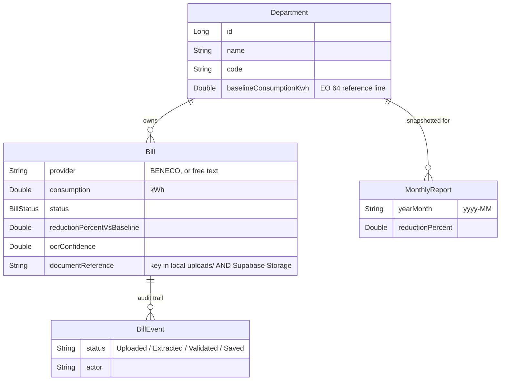

# Bill OCR Backend — Spec & Handoff

This is the backend for the OCR module of **TeamEnergy**: a Spring Boot service that takes a photo or PDF of a BENECO electricity bill, extracts the numbers, and turns them into the department leaderboard and 20%-reduction charts the capstone pitch promises (EO 64).

**Scope note:** the team agreed to focus on electricity (kWh) only for this phase — water/BWD is out, due to time constraints. The domain model below reflects that decision directly (no `UtilityType` branching anywhere); it's not water support that's temporarily disabled, it was designed out.

It's scaffolded and running — compiles clean, 5/5 tests pass, boots against both Supabase Postgres config and a local H2 fallback, and every endpoint below was hit manually and returned correct data. What's *not* done yet, or not yet verified against the real cloud services, is called out explicitly in [Known limitations](#8-known-limitations--next-steps) so nobody mistakes "scaffolded" for "finished."

---

## 1. Where it fits

```
team-energy/
├── src/                 (existing) React frontend — already expects everything below
└── backend/             (new) this Spring Boot service
```

The frontend's `BillLogging.jsx` already has a **mocked** two-step OCR flow (Upload → OCR extract → human Validate → Save) with a specific field contract. This backend was built to satisfy that contract exactly, not invented from scratch — see [Section 4](#4-api-contract) for the field-by-field match.

`src/services/api.js` in the frontend already points at `http://localhost:8080/api`, which is this service's default port.

---

## 2. Architecture

Standard 3-tier layering — Controller → Service → Repository — with strict DTO/Entity separation (controllers never return `@Entity` objects) and `@RestControllerAdvice` for centralized error handling, same pattern as the Coffee Shop project.

```
com.teamenergy.billocr
├── controller/      REST endpoints (thin — no business logic)
├── service/         business logic
│   └── ocr/         OCR engine, PDF→image, provider detection, regex parsers
├── repository/       Spring Data JPA interfaces
├── entity/          JPA-mapped tables
├── dto/
│   ├── request/     what controllers accept
│   └── response/    what controllers return (never an entity)
├── mapper/          entity ↔ DTO conversion
├── exception/       custom exceptions + GlobalExceptionHandler
├── storage/         local disk + Supabase Storage handling
└── config/          CORS, OCR engine, Supabase Storage config
```

**Why a strategy pattern for parsing, even with only one utility now:** this isn't a water hook — your own mock data already has *two* electric providers (BENECO and NUVELCO), and real bill layouts differ per provider. `BillParser` is an interface; `BenecoBillParser` implements it; `ProviderDetector` picks the right one by scanning OCR text for a known provider name. Onboarding a second electricity provider later means writing one more class, not touching existing ones.

---

## 3. Domain model



**Key decision — the baseline lives directly on `Department`, not in a separate table.** An earlier draft of this scaffold had a `DepartmentBaseline` join table, needed only because electricity and water would have required two independent baselines per department, in different units. With water out of scope, that's a 1:1 relationship — so it collapsed into a single `baselineConsumptionKwh` field on `Department`. Don't reintroduce the join table unless water actually comes back into scope.

**Out of scope for this module (by design):** users/auth, department CRUD (there's a read-only `GET /api/departments` here; creating/editing departments belongs to whoever owns org-admin), and the frontend's org-accounts page. This module owns bill ingestion + reduction reporting only.

---

## 4. API contract

### Step 1 — OCR extraction

```
POST /api/bills/extract
Content-Type: multipart/form-data
  file: <the bill image or PDF>
```

Returns (field names match `extractBillDataFromOCR()` in `BillLogging.jsx` exactly):

```json
{
  "provider": "BENECO",
  "accountNumber": "ACC-4521-8847-3",
  "billingDate": "2026-08-01",
  "billingPeriod": "July 1 - July 31, 2026",
  "dueDate": "2026-08-15",
  "totalAmount": 3245.50,
  "previousReading": 12450.0,
  "currentReading": 12875.0,
  "consumption": 425.0,
  "ocrConfidence": 0.94,
  "documentReference": "b3f1c2e4-....jpg"
}
```

Any field the parser couldn't find comes back `null` — the frontend's Validate step already handles a human filling in blanks, so this fails soft, not hard. If the provider itself can't be identified at all, the endpoint returns `422` with a message asking for manual entry (see `GlobalExceptionHandler`).

`documentReference` must be echoed back in step 2 so the saved bill stays linked to its source file.

### Step 2 — Save validated bill

```
POST /api/bills
Content-Type: application/json
```
Body = the form fields from the Validate step, plus `departmentId` (the frontend UI will need a department selector, currently missing). Bean Validation enforces required fields and positive numbers; a bad payload returns `400` with a `fieldErrors` map the frontend can map straight onto form fields.

Response is a full `BillResponse`, including the computed `reductionPercentVsBaseline` and a `timeline` array (`Uploaded → Extracted → Validated → Saved`) — this is what backs the timeline UI already in `mockBillHistory`.

### Reporting

| Endpoint | Purpose |
|---|---|
| `GET /api/bills?departmentId=` | Bill history list, optionally filtered |
| `GET /api/bills/{id}` | Single bill with timeline |
| `GET /api/reports/departments/{id}/summary` | Baseline, current-month consumption, reduction %, 6-month trend — feeds the Dashboard charts |
| `GET /api/reports/leaderboard` | Departments ranked by reduction % this month — the gamification leaderboard |
| `GET /api/departments` | Read-only department list (id, name, code, baseline), for populating selectors |

### Automatic monthly reports

`ReportingService.generatePreviousMonthSnapshots()` runs `@Scheduled(cron = "0 0 2 1 * ?")` — 02:00 on the 1st of each month — and writes one `MonthlyReport` row per department, so a report for July doesn't silently change if August's data comes in late. This is the literal "automation... for monthly reports" the task asked for, kept separate from the live dashboard queries (which always reflect current data).

---

## 5. How OCR actually works here

1. `FileStorageService` saves the upload locally, then (if configured) pushes the same bytes to Supabase Storage — see [Section 7](#7-supabase-database--storage).
2. `TesseractOcrTextExtractor` runs the local copy through Tesseract (via Tess4J) — PDFs are rasterized page-by-page first (`PdfToImageConverter`, Apache PDFBox), then OCR'd. It computes an overall confidence score from Tesseract's per-word confidence.
3. `ProviderDetector` scans the raw text for a known provider name ("BENECO").
4. The matching `BillParser` runs label-anchored regex over the raw text — e.g. `Total Amount Due\s*[:\-]?\s*(?:php|₱)?\s*([\d,]+\.\d{2})` — to pull each field. Consumption falls back to `currentReading - previousReading` if there's no explicit "Consumption" line.

**This is a deliberate MVP choice, not a limitation nobody noticed:** cloud Document AI (Google/Azure/AWS) would be materially more accurate, especially on skewed phone photos, but costs money and adds an external dependency. Rule-based extraction is free, self-hosted, and fully offline — a better fit for a capstone budget — at the cost of being more brittle if BENECO changes their bill layout. If accuracy becomes a problem in testing, swapping `OcrTextExtractor`'s implementation is a one-class change; nothing else in the pipeline needs to know.

**On real BENECO bill samples:** not needed to build or test anything in this section so far — `BenecoBillParserTest` validates the regex logic against hand-written sample text, and that's independent of whether a real bill photo exists yet. Real samples become necessary the moment someone wants to know "does this actually read a real BENECO bill correctly," which is a tuning task, not a blocker for anything built so far (including the Supabase work below). Worth asking your groupmate for a few photos soon so that task isn't sitting idle, but nothing here is waiting on it.

---

## 6. Running it

**Two ways to run, depending on whether your Supabase environment variables are set up:**

```bash
cd backend
./mvnw spring-boot:run                                          # default: Supabase Postgres + Storage
./mvnw spring-boot:run -Dspring-boot.run.profiles=local          # fallback: local H2, no Supabase needed
```

- API on `http://localhost:8080` either way.
- The default profile requires `SUPABASE_DB_URL`, `SUPABASE_DB_USER`, `SUPABASE_DB_PASSWORD` to be set (see [Section 7](#7-supabase-database--storage)) — the app fails fast at startup if they're missing, which is intentional so nobody accidentally runs against nothing.
- The `local` profile needs none of that — it boots against an in-memory H2 database exactly like before this change, for offline solo work or when Supabase is unreachable. Data there is **not** shared with the team and resets every restart.
- CORS is pre-configured for the Vite dev server (`http://localhost:5173`) on both profiles.
- **Before `/api/bills/extract` will work** (either profile), download `eng.traineddata` from the [tessdata repo](https://github.com/tesseract-ocr/tessdata) and point `app.ocr.tessdata-path` in `application.properties` at the folder it's in. This wasn't tested against a real bill photo yet.

```bash
./mvnw test                  # 5/5 passing: BillServiceTest (Mockito), BenecoBillParserTest
```

---

## 7. Supabase (database + storage)

Two independent pieces, both driven by environment variables — nothing Supabase-related is hardcoded or committed to the repo.

### 7a. Database — Supabase Postgres replaces H2 as the shared source of truth

**Why:** H2 is in-memory. Every teammate running the app locally had their own empty database that vanished on restart — nobody's bills, departments, or leaderboard data was ever shared. Supabase's Postgres is the same database for everyone on the team, all the time.

| Env var | Where to find it in the Supabase dashboard |
|---|---|
| `SUPABASE_DB_URL` | "Get connected" → **Direct** tile → connection string (use the `jdbc:postgresql://...` form, port **5432**) |
| `SUPABASE_DB_USER` | Same tile, usually `postgres` |
| `SUPABASE_DB_PASSWORD` | Set when the project was created — ask whoever created the project if you don't have it. **Never commit this or paste it into chat/docs.** |

Set these as real environment variables (shell `export`/`$env:`, or your IDE's run configuration) — not in a file that gets committed.

**Use the Direct connection (port 5432), not the Transaction pooler (6543).** Supabase's transaction-mode PgBouncer pooler doesn't support prepared-statement caching the way Hibernate/HikariCP expect by default, and it's a known source of "prepared statement already exists" errors for JPA apps specifically. Direct connection avoids that, and a nano-tier free project won't hit connection-count limits at this team's scale.

**Two things had to change to make a *shared, persistent* database safe, that didn't matter with disposable H2:**
- `spring.jpa.hibernate.ddl-auto` went from `create-drop` to `update`. Leaving it as `create-drop` would mean the next teammate who restarts their app **drops and recreates every table**, deleting everyone else's data. `update` is a pragmatic capstone-timeline choice over a full migration tool (Flyway/Liquibase) — it adds missing tables/columns but won't drop or rename anything, so review generated DDL if you ever change a field's type.
- `data.sql` became `data-postgres.sql` with `INSERT ... ON CONFLICT (code) DO NOTHING` instead of a plain `INSERT`. A plain insert would throw a duplicate-key error the second time *anyone* starts the app, since the seeded departments already exist from the first run. It also re-syncs the identity sequence after the manually-seeded ids (1–4) via `setval(...)`, so the next auto-generated department id (once org-admin CRUD exists) doesn't collide with them.
- A parallel `data-h2.sql` (plain inserts, no `ON CONFLICT`) backs the `local` profile, where the database is dropped and recreated every run anyway.

**Verification status:** compiled, tested, and boot-verified against the `local` H2 profile in this environment (no Docker/Postgres available here to test against directly). The Postgres-specific SQL (`ON CONFLICT`, `setval`/`pg_get_serial_sequence`) is standard, well-established Postgres syntax, but **has not been run against the actual Supabase database yet** — that's the first thing to check once `SUPABASE_DB_URL` etc. are set locally: boot the app, confirm the 4 departments show up in `GET /api/departments`, restart it, and confirm they're still there (not recreated) and no error was thrown.

### 7b. Storage — Supabase Storage holds a durable copy of uploaded bill files

**Why:** `FileStorageService` was writing uploads only to local disk (`uploads/`, gitignored) — fine for OCR to process, useless for the team, since a bill photo uploaded on one laptop was invisible to everyone else and gone if that laptop's `uploads/` folder was ever cleared.

**How it works now:** Tesseract still needs a local file to actually run OCR against (it can't read a remote bucket directly), so uploads are written locally exactly as before — that part didn't change. What's new is that `FileStorageService.store()` also pushes the same bytes to a Supabase Storage bucket, using `documentReference` as the same key in both places. There's no official Supabase SDK for Java/Spring, so `SupabaseStorageClient` calls the Storage REST API directly (`POST /storage/v1/object/{bucket}/{path}`) via Spring's `RestClient`.

| Env var | Where to find it |
|---|---|
| `SUPABASE_URL` | Dashboard header, right under the project name — the `https://<project-ref>.supabase.co` URL (this one isn't secret) |
| `SUPABASE_SERVICE_ROLE_KEY` | "Get connected" → **API Keys** tile → `service_role` key. **Secret** — this key bypasses row-level security, must never reach the frontend, and lives server-side only. |

**Bucket:** `bill-documents`, created manually in the Supabase dashboard (Storage → New bucket) as **private**, not public — bills carry account numbers and amounts.

**Storage is optional, not required, to boot the app.** If `SUPABASE_URL` / `SUPABASE_SERVICE_ROLE_KEY` aren't set, `FileStorageService` logs it and just keeps the file local-only — uploads and OCR still work fully, they just don't sync anywhere. This was a deliberate choice (`SupabaseStorageProperties.isConfigured()`) so the database and storage integrations can be turned on independently, and so the `local` profile keeps working with zero Supabase setup at all.

**Verification status: written against Supabase's documented Storage REST API, but NOT tested against a live bucket** — I don't have a service-role key, correctly, since that shouldn't be pasted into chat. This is the most likely piece to need a fix on first real use if Supabase's endpoint/header shape has shifted. To verify: set both env vars, create the `bill-documents` bucket, hit `POST /api/bills/extract` with any file, and check the Supabase dashboard's Storage browser for the uploaded object. If it 502s, the error message will say "Storage Unavailable" with the underlying cause — check that first.

---

## 8. Known limitations & next steps

- **Regex patterns are unverified against real bills.** `BenecoBillParserTest` proves the regex logic works against text written by hand to look like a BENECO bill — nobody has run it against an actual scanned BENECO bill yet. Not urgent, not blocking anything else, but worth asking your groupmate for a handful of real bill photos soon so this doesn't become a last-minute scramble.
- **Supabase Storage upload is untested against a live bucket** (see 7b) — needs a real `service_role` key to verify.
- **Supabase Postgres seeding (`ON CONFLICT` + `setval`) is untested against real Postgres** (see 7a) — standard syntax, but worth a first-boot check.
- **No department picker in the frontend yet.** The save endpoint requires `departmentId`; `BillLogging.jsx`'s form doesn't currently collect one.
- **No auth wired in.** Every endpoint is open right now. The frontend already has role-based mock auth (`authStore.js`) — connecting real auth is a separate task, deliberately not bundled into this OCR module.
- **OCR accuracy on phone photos is untested and will be the weakest link** (glare, skew, low light). The human Validate step in the frontend isn't a nice-to-have here — treat it as load-bearing.
